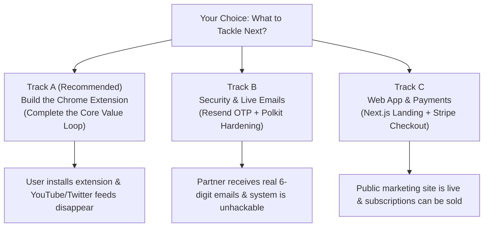

# Master Launch Action Plan: ZeroFeed Public Release

**Document**: `launch-action-plan.md`  
**Author**: `project-planner`  
**Current Status**: Electron Desktop App (Linux) + Express/Prisma Backend Functional with Passing Tests  
**Target Milestone**: Public Commercial Launch  

---

## 1. Executive Summary & Where We Stand

ZeroFeed has built the **foundational enforcement and database layer**:
- **PostgreSQL Database**: 9 isolated, clean, sequential migrations applied with composite performance indexes and tamper-evident `audit_logs` table.
- **Central Backend API**: Express + TypeScript + Prisma with Google token verification, JWT rotation, and partner OTP verification logic (11/11 tests passing).
- **Desktop Application (Linux)**: Electron client with bilateral partner OTP verification, `pkexec` elevation, and Chrome Enterprise Policy generation (6/6 tests passing).

However, **to actually launch and make the product functional for end users**, three major areas remain to be built:
1. **The Chrome Extension (`/extension`)**: Without this, Chrome enforces an empty extension ID; no feeds are actually blocked.
2. **Production Security & Communication**: Partner OTPs must be delivered via real email (Resend/SES) instead of `console.log`, and OS policy permissions must be hardened (replacing `chmod 666` with a Polkit root helper).
3. **The Web Client (`/web`) & Monetization**: Users need a landing page to discover ZeroFeed, sign in with Google, pay for a subscription (Stripe/Razorpay), and download the desktop app.

---

## 2. The 3 Implementation Tracks: Which One to Execute Next?

### Track A: Complete the Core Value Loop (Chrome Extension MVP) — *Recommended Next*
* **Why**: This delivers the actual user-facing value. Once the extension is built, you can load it into Chrome and immediately experience ZeroFeed eliminating YouTube recommendations, Shorts, and distraction feeds under enterprise lock.
* **Scope**: Manifest V3 extension, YouTube feed blocker & Shorts redirector, Twitter/LinkedIn feed blocker, popup status UI.

### Track B: Production Security, Live Email & Polkit Hardening
* **Why**: Makes the system production-secure. Eliminates the world-writable `chmod 666` policy file risk, delivers 6-digit OTPs to real partner email addresses via Resend/SES, and wires tamper-evident audit logs.
* **Scope**: Polkit helper binary, Resend transactional email integration, salted SHA-256 OTP hashing in DB, AuditService event hooks.

### Track C: Public Web App & Commercial Monetization
* **Why**: Enables customer acquisition. Provides a public face, automated onboarding funnel, and Stripe/Razorpay checkout to collect revenue.
* **Scope**: Next.js App Router project in `/web`, Neo-Brutalist landing page, Google Identity Services, Stripe Checkout sessions, and webhook processing.

---

## 3. Detailed Task Breakdown & Dependency Graph

### Track A: Chrome Extension MVP (`/extension`)

| Task ID | Task Name | Agent | Skills | Priority | Dependencies | Verification (INPUT → OUTPUT → VERIFY) |
|---|---|---|---|---|---|---|
| **A-1** | Scaffold MV3 Extension | `frontend-specialist` | `clean-code` | P0 | None | **INPUT**: Chrome Extension specs **OUTPUT**: `/extension/manifest.json` with permissions (`declarativeNetRequest`, `storage`, `alarms`) **VERIFY**: Load unpacked in `chrome://extensions` without manifest errors. |
| **A-2** | YouTube Feed Blocker & Shorts Redirector | `frontend-specialist` | `clean-code` | P0 | A-1 | **INPUT**: YouTube DOM structure **OUTPUT**: `/extension/content-scripts/youtube.js` hiding home feed (`ytd-rich-grid-renderer`) and redirecting `/shorts/*` to `/watch?v=*` **VERIFY**: Navigate to youtube.com; home feed is clean; shorts play as standard videos. |
| **A-3** | Social Feed Blocker (X / LinkedIn) | `frontend-specialist` | `clean-code` | P1 | A-1 | **INPUT**: Twitter/LinkedIn DOM classes **OUTPUT**: `/extension/content-scripts/social.js` hiding primary timelines while preserving search & messaging **VERIFY**: Navigate to twitter.com & linkedin.com; feeds are hidden; search and DMs work. |
| **A-4** | Extension Background Worker & Policy Sync | `frontend-specialist` | `api-patterns` | P1 | A-1 | **INPUT**: Backend `GET /api/v1/policy` **OUTPUT**: `/extension/background.js` fetching policy state every 15m and caching in `chrome.storage.local` **VERIFY**: Check extension storage logs; policy rules match backend response. |
| **A-5** | Extension Status Popup UI | `frontend-specialist` | `frontend-design` | P2 | A-1 | **INPUT**: Neo-Brutalist design tokens **OUTPUT**: `/extension/popup/popup.html` displaying partner lock status and quick link to unlock **VERIFY**: Click extension icon in toolbar; popup renders status badge. |

---

### Track B: Production Security & Email Infrastructure

| Task ID | Task Name | Agent | Skills | Priority | Dependencies | Verification (INPUT → OUTPUT → VERIFY) |
|---|---|---|---|---|---|---|
| **B-1** | Hardened Polkit Helper (`0644 root:root`) | `devops-engineer` | `bash-linux` | P0 | None | **INPUT**: `policy-enforcer.js` **OUTPUT**: `/usr/lib/zerofeed/zerofeed-policy-helper` & `com.zerofeed.policy.policy` replacing `chmod 666` **VERIFY**: Run policy enforcer; file is written as `0644 root:root`; unprivileged write is rejected. |
| **B-2** | Transactional Email Integration (Resend/SES) | `backend-specialist` | `clean-code` | P0 | None | **INPUT**: `email.service.ts` **OUTPUT**: Live Resend/SES email provider dispatching branded HTML 6-digit OTPs **VERIFY**: Request unlock; partner receives live email in inbox within 5 seconds. |
| **B-3** | Salted SHA-256 OTP Hashing in PostgreSQL | `security-auditor` | `database-design` | P0 | None | **INPUT**: `policy.service.ts` **OUTPUT**: Salted SHA-256 hash stored in DB; `crypto.timingSafeEqual` verification **VERIFY**: Check `policy_verification_requests` in DB; plaintext code is absent; verification succeeds. |
| **B-4** | Cryptographic Tamper-Evident Audit Ledger | `backend-specialist` | `database-design` | P1 | None | **INPUT**: `AuditLog` table **OUTPUT**: `backend/src/services/audit.service.ts` creating SHA-256 HMAC hash chains for all policy actions **VERIFY**: Perform lock/unlock; query `audit_logs`; verify `prevHash` links to previous signature. |
| **B-5** | API Rate Limiting & Helmet CSP | `security-auditor` | `clean-code` | P1 | None | **INPUT**: Express app **OUTPUT**: Rate limiters on `/auth/google` (10/15m) and `/policy/request-otp` (3/15m); Helmet CSP **VERIFY**: Send 4 consecutive OTP requests; 4th returns HTTP 429 Too Many Requests. |

---

### Track C: Public Web Client & Commercial Monetization

| Task ID | Task Name | Agent | Skills | Priority | Dependencies | Verification (INPUT → OUTPUT → VERIFY) |
|---|---|---|---|---|---|---|
| **C-1** | Scaffold Next.js Web Client (`/web`) | `frontend-specialist` | `nextjs-react-expert` | P0 | None | **INPUT**: Next.js 14 App Router + Tailwind **OUTPUT**: Initialized `/web` directory with Neo-Brutalist typography and color tokens **VERIFY**: `npm run dev` in `/web`; home route renders at `localhost:3000`. |
| **C-2** | Public Landing Page & Download Showcase | `frontend-specialist` | `frontend-design` | P0 | C-1 | **INPUT**: Brand copy & anti-dopamine positioning **OUTPUT**: High-converting landing page with feature cards, pricing tiers, and desktop installer links **VERIFY**: Page passes Lighthouse accessibility & responsive checks. |
| **C-3** | Web Google Sign-In & Onboarding Wizard | `frontend-specialist` | `clean-code` | P0 | C-1 | **INPUT**: Google Identity Services (GIS) **OUTPUT**: Google button, token exchange with `/api/v1/auth/google`, and 5-step onboarding flow **VERIFY**: Sign in on web; user profile created; redirected to partner nomination. |
| **C-4** | Stripe Payment Service & Checkout Session | `backend-specialist` | `api-patterns` | P0 | None | **INPUT**: Stripe Node SDK **OUTPUT**: `backend/src/services/payment.service.ts` and `/api/v1/payments/checkout` endpoint **VERIFY**: Click "Subscribe"; user is redirected to Stripe Checkout session with correct price. |
| **C-5** | Stripe Webhook Processing & Auto-Activation | `backend-specialist` | `api-patterns` | P0 | C-4 | **INPUT**: Stripe webhook event **OUTPUT**: Express raw body webhook handler verifying `stripe-signature` and updating `SubscriptionStatus: ACTIVE` **VERIFY**: Simulate `checkout.session.completed` via Stripe CLI; user subscription becomes `ACTIVE`. |

